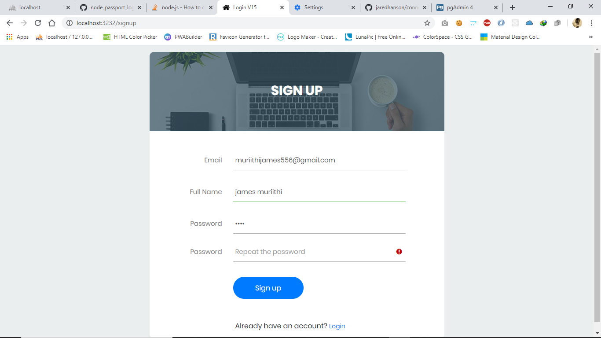

# Node.js & Passport Login

This is a user login and registration app using Node.js, Express, Passport, Mongoose, EJS and some other packages.

### Version: 1.0.0




### Usage

```sh
$ git clone 
$ npm install
```

```sh
$ npm start
# Or run with Nodemon
$ npm run dev

# Visit http://localhost:3232
```

### Postgres
Open ".env" and add configuration